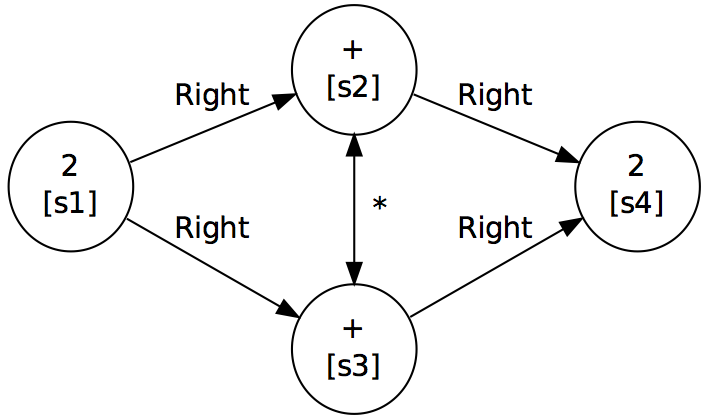
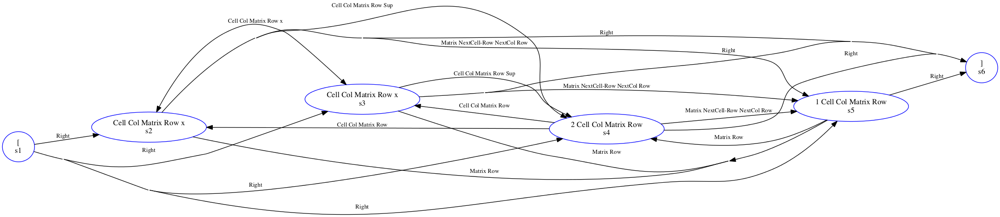
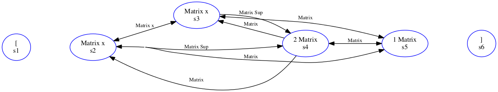

<!-- MathJax Support for in-line LaTeX -->
<head>
  <meta charset="utf-8">
  <meta name="viewport" content="width=device-width">
  <script src="https://polyfill.io/v3/polyfill.min.js?features=es6"></script>
  <script id="MathJax-script" async src="https://cdn.jsdelivr.net/npm/mathjax@3/es5/tex-mml-chtml.js"></script>
</head>


# Label Graph Evaluation Tools (LgEval) 
## Version 0.3.8 (March 2022)
   
   
*Copyright (c) 2012-2022, Richard Zanibbi, Harold Mouchère, and Ayush Kumar Shah*

[Richard Zanibbi][rlaz] (rlaz@cs.rit.edu)  
Document and Pattern Recognition Lab,
Rochester Institute of Technology, USA

[Harold Mouchère][hm] (harold.mouchere@univ-nantes.fr)  
IRCCyN/IVC Lab, University of Nantes, France

[Ayush Kumar Shah][as] (as1211@rit.edu) (as1211@rit.edu)  
Document and Pattern Recognition Lab,  
Rochester Institute of Technology, USA

## License


*These tools are provided 'as is' without any guarantee of suitability for non-research use.  No commercial use is permitted. The tools are being distributed under a Creative Commons license (please see the LICENSE file, and the directory cc_license contains a file detailing the specifics of the license).*

## Changes Aug 2021 - Mar 2022

* Improved HTML error visualization (aks)
* README update / refresh, updates for MathJax-3 and support (rz)
* Added CROHME 2019 conversion scripts (rz)
* Made translation/MathML unknown symbol errors optional (rz)
* Standardized import statements, added PYTHONPATH to installation instructions (aks)
* New 'lgeval' conda environment for python package install + environment variables (rz)


[rlaz]: https://www.cs.rit.edu/~rlaz  "Richard Zanibbi's Home Page"
[hm]: https://www.irccyn.ec-nantes.fr/~mouchere "Harold Mouchère's Home Page"
[as]: https://shahayush.com/tabs/about/ "Ayush Kumar Shah's Home Page"
  


## Contents


* [Overview](#purpose)
* [Important Notes](#notes)
* [Installation](#install)
* [Getting Started](#quickstart)
	* [First Example: Results without Errors](#firsteg)
	* [Summary.txt - The Evaluation Results Summary](#summary)
	* [Another Example: Results with Errors](#egtwo)
	* [Automated Error Analysis](#confhist)
	* [Finishing Up and Next Steps](#next)
* [LgEval Tools](#tools)
    * [Evaluation and Visualization](#evaltools)
    * [File Manipulation](#files)
* [Label Graph Files](#lgdescription)  
	* [I. Primitive Format](#primitive)
	* [II. Object Format](#object)
	* [III. Multiple Levels of Structure](#multiple)
	* [IV. Symbol Label Graphcs](#symlg)
* [References](#refs)


## <a name="purpose"></a>Overview

The Label Graph Evaluation tools (LgEval) were originally developed for scoring handwritten math recognition systems for the [Competition on Recognition of Online Handwritten Mathematical Expressions][crohmeurl] which has been run annually between 2011 and 2014, and then again in 2016 and 2019.
For CROHME, the library was used to obtain stroke and symbol-level evaluation of handwritten math expressions. However, label graphs are a very general representation, and may be used to represent and evaluate structural similarity for other problems.

A *label graph* is simply a labeled directed graph. Both nodes and edges are labeled, representing the grouping of input primitives into objects (e.g. grouping strokes into symbols), object types (e.g. symbol names) and relationships between objects. The section [Label Graph Files](#lgdescription) describes the representation in detail. The current version of the library may be used to r**epresent and evaluate multiple levels of structure** (e.g. for matrices, which contains symbols, cells, rows, and columns).

Label graphs allow an *absolute* difference between two structure representations to be computed, even when the segmentation of *input* *primitives* (e.g., a list of handwritten strokes) into objects (e.g., symbols) disagree, and even when primitives are missing in one or other interpretation. This difference is obtained directly from disagreeing edge and node labels, along with associated Hamming distances (i.e., counting disagreeing node and edge labels). Input primitives are assumed to be a fixed set, but can represent any object (e.g. connected components, bounding boxes, pixels in an image, or a combination of these).

In addition to metrics, the library provides visualization of label graphs at the primitive and object levels using the **lg2dot** program. Additional information about label graphs and CROHME may be found in the [References](#refs) section. 

[Graphviz]: http://www.Graphviz.org/ "Graphviz web site"

## <a name="notes"></a>Important Notes

1. For those wishing to use LgEval with the CROHME competition data, you will also need to install CROHMELib, which is provided separately [here](https://gitlab.com/dprl/crohmelib).
	
2. We also ask that you cite the following paper describing label graphs and associated
	metrics in any publications that you produce using LgEval:  
	
	R\. Zanibbi, H. Mouchere, and C. Viard-Gaudin (2013) [Evaluating Structural Pattern Recognition for Handwritten Math via Primitive Label Graphs][drr2013paper]. Proc. Document Recognition and Retrieval, Proc. SPIE vol. 8658, pp. 17-1 - 17-11, San Francisco, CA. 	
3. Information about file differences, metrics and key data structures used for evaluation are provided in the [README_MetricsData.txt][readme2] file. 

 [readme2]: README_MetricsData.txt  "README: Metrics and Data"


## <a name="install"></a>Installation

**Dependencies:** Before you install LgEval, make sure that the following have also been installed on your system.

1. bash
2. perl (**with LibXML**)
3. python 3.x
4. [Graphviz](https://graphviz.org) (for 'dot')
5. [Pandoc](https://pandoc.org)
6. Conda (e.g., from Anaconda) and pip for Python environments

**Conda LgEval Environment Install (preferred approach).** To install
the conda environment for lgeval, which will set up both Python packages and
necessary paths for LgEval command line tools, issue: 
``` 
make 
```

After installation, the LgEval conda environment can be started by issuing:
```
conda activate lgeval
```
at which point all LgEval tools (e.g., `evaluate`) should be usable as commands at the command line. 

To stop using the lgeval conda environment, issue:
```
conda deactivate
```
Note: this will reset shell variables to their previous values.

**Alternative: Bash shell modification (for LgEval and CROHMELib).**
To use the LgEval tools from the command anywhere on your system, make sure that *CROHMELibDir* and *LgEvalDir* are defined in
your shell enviroment, e.g. by including the following in your .bashrc  initialization script for bash shell. The last line adds the
tools to your search path.
	
	export LgEvalDir=<path_to_LgEval>
	export CROHMELibDir=<path_to_CROHMELib>  	
	export PATH=$PATH:$CROHMELibDir/bin:$LgEvalDir/bin
	export PYTHONPATH=$PYTHONPATH:$(dirname "$LgEvalDir"):$(dirname "$CROHMELibDir"):

## <a name="quickstart"></a>Getting Started

The easiest way to evaluate recognition results using LgEval is the `evaluate`
script with two directories, the first containing output .lg (label graph)
files, and the second containing .lg files containing the corresponding ground
truth (i.e., target/'correct' interpretation) files. 

### <a name="firsteg"></a>First Example: Results without Errors

Try running the following from the `lgeval/` directory. In this first example, we start the lgeval conda environment so that our tools are available from the command line, and then compare a set of ground truth files with themselves.

```
conda activate lgeval
evaluate tests/io_tests/small-GT tests/io_tests/small-GT
```

This produces a new directory `Results_small_GT` with the following contents: 

```
Results_small-GT
├── 00_NoErrors
├── ConfusionMatrices.csv
├── ConfusionMatrices.html
├── Correct.csv
├── FileMetrics.csv
├── Metrics
│   ├── UN_101_em_0.csv
│   ├── UN_101_em_1.csv
│   ├── UN_101_em_10.csv
│   ├── UN_101_em_2.csv
│   ├── UN_101_em_3.csv
│   ├── UN_101_em_4.csv
│   ├── UN_101_em_5.csv
│   ├── UN_101_em_6.csv
│   ├── UN_101_em_7.csv
│   ├── UN_101_em_8.csv
│   └── UN_101_em_9.csv
├── Summary.txt
├── labelsGT.txt
└── labelsOutput.txt
```
Here is quick tour of what this directory contains.

* The `00_NoErrors` file is empty, and simply indicates that no errors were produced. 
* Confusion matrices are provided in two formats, one for reading (HTML), and one for computing. Try opening `ConfusionMatrices.html` in a web browser to see this.
* `Correct.csv` records which files were fully correct. 
* `FileMetrics.csv` is simply a compilation of the individual evaluation metric files (one per input file) in the `Metrics` directory. 
* The individual files in `Metrics/` provide individual file metric results, and are used in a quick-and-dirty way to  allow `evaluate` to be run multiple times, for example to avoid having to re-evalate all output files after making corrections for just a handful of them. 
* The `labelsGT.txt` and `labelsOutput.txt` provide a list of *all* node and edge labels present in label graphs for ground truth and the output files, respectively.

### <a name="summary"></a> Summary.txt - The Evaluation Results Summary 

Finally, `Summary.txt` provides a summary of various recognition metrics. These include recognition rates, as well as recall, precision, and F1 scores for detection metrics. The metrics are grouped by:

* *detecting* objects and object relationships (`Objects`,`Relations`) 
* *detecting and classifying* objects and their relationships (`Objects + Classes`, `Relations + Classes`)
* *graphs with correct structure* (`Stucture`)
* *graphs with correct structure and object + relationship class labels* (`Structure + Classes`)
* For development and debugging (but **not as an evaluation metric**), we also provide the  classification rate for correctly segmented objects and relationships (`Class/Det`) 

The `Summary.txt` file is broken into four different sections, corresponding to three different levels of structure (primitive, object, and graph (i.e., input `File`)), and Hamming distances over directed, primitive-level label graphs. 

* **Input Primitives and Edges Between Primitives:**  classification rates and error types for input nodes (primitives) and edges between input primitives. Metrics are presented for both directed and undirected complete graphs.  
* **Objects and Object Relationships:** metrics for segmentation/detection over primitives (input nodes), such as symbols comprised of one or more primitives, and metrics for edges over objects, such as for spatial relationships between symbols (e.g., 'superscript')
* **File Metrics:** Recognition rates for entire files (e.g., the percentage of files with correct segementation of objects, and correct segmentation of objects and their classes).
* **Label Error Histrogram:** Shows a histogram of the number of files with k or fewer primitive-level directed graph errors in input node or edge classification errors (0 <= k <= 5), along with the cumulative number of files with at most k errors.

**See the Section on [Label Graph Files](#lgdescription) for details on how primitives and objects are related.** Also, a detailed description of all metrics used in LgEval can found in the file [README_MetricsData.txt](README_MetricsData.txt).

### <a name="egtwo"></a>Another Example: Results with Errors

Now let's try running the tool wtih some output files containing many errors. Issue the following command:

```
evaluate tests/io_tests/small-out tests/io_tests/small-GT
```
This produce a new results directory called `Results_small-out` (named after the output file directory), with the following structure:

```
Results_small-out
├── ConfusionMatrices.csv
├── ConfusionMatrices.html
├── Correct.csv
├── FileMetrics.csv
├── Metrics
│   ├── UN_101_em_0.csv
│   ├── UN_101_em_0.diff
│   ├── UN_101_em_1.csv
│   ├── UN_101_em_1.diff
│   ├── UN_101_em_10.csv
│   ├── UN_101_em_10.diff
│   ├── UN_101_em_2.csv
│   ├── UN_101_em_2.diff
│   ├── UN_101_em_3.csv
│   ├── UN_101_em_3.diff
│   ├── UN_101_em_4.csv
│   ├── UN_101_em_4.diff
│   ├── UN_101_em_5.csv
│   ├── UN_101_em_5.diff
│   ├── UN_101_em_6.csv
│   ├── UN_101_em_6.diff
│   ├── UN_101_em_7.csv
│   ├── UN_101_em_7.diff
│   ├── UN_101_em_8.csv
│   ├── UN_101_em_8.diff
│   ├── UN_101_em_9.csv
│   └── UN_101_em_9.diff
├── Summary.txt
├── labelsGT.txt
└── labelsOutput.txt
```
The contents of the directories are the same as in the previous example, except that the `00_No_Errors` file is missing, and there are now `.diff` files in the `Metrics/` directory, containing the specific differences between each output file and its corresponding ground truth file. The `.diff` files are CSV files contain error entries of the following types:

* *N: input primitive (node) classification errors
* *E: input primitive relationship (directed edge) classification errors
* *S: input primitive segmentation (grouping) errors

Note that '_' represents 'no label', or 'undefined' (e.g., for edges without a label).

If we look at the `Summary.txt` file, we'll notice that only 1 file had all of its handwritten strokes correctly segmented into symbols, and that no files had fully correct (unlabeled) graph structure or labeling of symbols and relationships. 

Looking at the `ConfusionMatrices.html` file in a web browser, we can also look at counts for specific classification errors. The page provides some description of the errors presented. 

### <a name="confhist"></a>confHist - Automated Error Analysis for Subgraphs

The confusion matrices are informative, but they do not tell us things such as what the most commonly misrecognized symbol was, the types of errors made in segmentation and classification, and which files these occurred in.

To get this more detailed error analysis in the form of graph-level *confusion histograms*, we can issue:

```
confHist tests/io_tests/small-out tests/io_tests/small-GT --graphSize 1
```

This produces the following output directory, with an HTML file and subdirectories as shown:

```
confHist_outputs
├── CH_small-out_vs_small-GT__size_1_min_1.html
├── CH_small-out_vs_small-GT__size_1_min_1_gt_htmls
├── css
├── dotpdfs
├── js
└── small-out_vs_small-GT
```
For this first time through, we simply want to open the HTML file in a web browser (**Note:** Google Chrome works best). This file visualizes a histogram of confusions between ground truth graphs (at left) and output graphs (shown in the errors lists at right). Ground truth symbols are shown in the leftmost two columns - the symbol class in the leftmost column, and the **primitive-level graph structure** of the ground truth symbol in the second column. From the third column on are shown the **specific errors** seen for the primitives in the ground truth symbol. 

The  HTML file shows these symbol recognition errors in decreasing order of frequency, along with all specific instances of errors made for that symbol -- itself sorted by decreasing order of frequency from left to right.

**Examples of Errors.** If we look at row 4, we see errors made between a handwritten 'x' in ground truth (an 'object') drawn with two strokes. We can also see in row 14 errors for summation symbols (Sigma) drawn with three handwritten strokes. In that particular case, one error was a miclassification of the symbol as epsilon (`\in`), and in the second case the symbol was split in two, with one stroke treated as a `c`, to the right of which the two other strokes were correctly labeled `\sum` (indicated by yellow nodes). 

**Saving and Viewing Files with Errors.** To obtain a list of files that contain specific errors, you can use the check boxes in the interface, and then press `Save Selected Files` at the top of the web page. This will create a text file `selectedFiles.txt` in the downloads folder for your browser.

In addition to this, we can browse through the specific files that cause the errors. For example, for the first errors shown for the most common misrecognition for a symbol (`-`).

If you click on the `4 errors` link above the red node with a `1` (indicating that four files misclassified this symbol comprised of one primitive (stroke) as a `1`), we are taken to another page showing the files where the errors occurred, and the graph representing the errors made in each file (indicated in red, and with alternate labels). The numbers at the bottom of each square node are the identifiers for primitives (strokes) belonging to each symbol.

**Object Edges and Larger Ground Truth SubGraphs:** `confHist` can also be used to view the most common errors between pairs of objects with an associated edge. To see this issue:

```
confHist tests/io_tests/small-out tests/io_tests/small-GT --graphSize 2
```
And then again look at the newly generated HTML file: `confHist_outputs/CH_small-out_vs_small-GT__size_2_min_1.html`, which can be used in the same ways as described above for `confHist` results for individaul symbols.

We can see generate errors for sub-graphs of larger `--graphSize` values (e.g., 3, 4, ...), but be warned that because of the complexity of subgraph matching, as the subgraph size increases, the time to compute the result increases, and this can be quite long for large file sets. Previously, we have found that graphSizes 1 and 2 for symbols and symbol relationships were most useful for the CROHME handwritten math recognition competitions, with size 3 sometimes also being useful (e.g., to check errors when for detecting fractions).

### <a name="next"></a>Finishing Up and Next Steps

At this point, if we are done using lgeval, issue:

```
conda deactivate
```

to close the conda lgeval environment.

**Next Steps.** There are other ways that the tools can be used (e.g., using manually created pairs of file lists with `evaluate`), and other tools in the library that we have not covered here. You can find more information about these tools and the underlying labeled graph representation and file formats (NE: primitive node-edge and OR: object-relationship) below.

As a reminder, more details about the specific metrics and differences computed by LgEval, along with key data structures are available in the file [README_MetricsData.txt](README_MetricsData.txt).


## <a name="tools"></a>LgEval Tools


The main tools for LgEval are provided in the *bin/* subdirectory. Call a script without arguments for usage instructions. A doxygen-generated summary of files and classes is available at [doc/html/files.html](doc/html/files.html).

### <a name="evaltool"></a>Evaluation, Error Analysis, and Graph/Error Visualization

**evaluate, evaluateMat**   
	*evaluate* is the main evaluation script for label graphs. It 
	automatically produces metrics, differences, a result summary,
	and visualizations of recognition errors (requires Graphviz). The program
	produces evaluation results given a directory of output files and
	a corresponding directory of ground truth files, or a user-defined file list. 
	
  * **NOTE:** If a node is absent in one of two graphs being compared, it will be inserted as an 'ABSENT' node with unlabeled edges ('_') between the ABSENT node and all other nodes in the graph. See Lg.matchAbsent() in the file lg.py.

	
*evaluateMat* is used to evaluate output for expressions containing matrices
	(used for the matrix recognition task in CROHME 2014). 
	
**confHist**  
Create structure confusion histograms as HTML pages, which show target structures (e.g. of
1-3 symbols) or stroke groups, along with corresponding error graphs and their
frequencies. To save space, the user can specify the minimum number of times
that an error must occur to be included in the output. This provides a detailed
summary of the specific segmentation and classification errors made by a
recognition algorithm. The structure confusion histograms at the object and
stroke levels are stored in a (large) .html file.


    
**lg2dot**  
	Create .dot and .pdf output for a label graph, or visualize the
	difference between two label graphs. Different graph types may be
	produced (requires Graphviz), and differences between
	a pair of graphs may also be visualized. The following graph
	types are supported:

  * Primitive label graphs (e.g. as shown in Figs. 1-3 above)
  * Bipartite primitive label graphs
  * Bipartite segmentation graphs for primitives
  * Directed Acylcic Graph (DAG) represention of objects and object relationships 
  * Rooted tree for hierarchical relationship structures (e.g. symbol layout in math expressions)
  
    **Note:** The DAG and tree visualizations assume that a single level of structure is
  being visualized.
  
**cdiff, ldiff and vdiff**  
Used to compile labeling errors of given types (*cdiff*), or return the a list of the files containing these errors (*ldiff*) and view them (*vdiff*) using 'less.' Regular expression matching over node and edge labels is supported ('egrep' format), and files with or without segmentation errors may be selected for. These tools operate on the .diff files created by *evaluate.*

**src/metricDist.py**  
	Used to select a metric from a CSV file (.m) produced by the 'evallg.py'
	program (used by **evaluate**). Useful for producing histograms.

### <a name="files"></a> File Generation, Conversion, and Filtering

**convert2symLG/**   
Created for CROHME 2019. This directory contains scripts to convert LaTeX, MathML, and primtive-based LG files to the Symbol LG (symLG) format. Details are provided above. After using these converters, metrics may be computed between different representations using the LgEval tools.

**lg2OR and lg2NE**  
    Label graph format converters. Each takes a label graph as input, and outputs a label graph in OR (Object-Relation) or NE (primitive Node-Edge) format on standard output. OR files are equivalent to NE files, but more compact and easier to read.

**getlg, getinkml, getpdf**  
From a file containing a list of .lg files (one per line), copy these files from one directory to another (*getlg*), or copy corresponding .inkml files or dot-generated pdf files from one directory to another (*getinkml*,*getpdf*).

    
**lg2lgtree**  
	Converts a directory of label graphs using lgfilter (i.e. producing
	trees as output), writing the output files to another directory.
	
**lg2mml**  
	Create MathML output from a label graph (requires CROHMELib). 

**src/lg2txt.py**   
	Convert a graph to a string encoding. Symbol and structure
	mappings are be defined using rules in an accompanying .csv file. An example MathML mapping file is provided in *translate/mathMLMap.csv.* A (largely incomplete) LaTeX mapping (*translate/symbolMap.csv*) is also provided (used by `lg2mml`).

**lgfilter**  
	Removes non-tree edges from a hierarchically structured label graph (e.g. to obtain symbol
	layout trees from a DAG with inherited relationships for math notation).  

**relabelEdges and relabelOldCROHME**  
Tools to replace edge labels in 'old' label graph files using '*' to indicate
merged primitives.

**src/mergeLg.py**  
	Reads two or more .lg files and merges them, printing the result on
	standard output.

##  <a name="lgdescription"></a>Label Graph File Format


   There are two formats that may be used to represent a label graph, which may be combined in a single file. Additional example .lg files are provided in the *src/Tests/* subdirectory. 
   
### <a name="primitive"></a>I. Primitive Format (Adjacency Matrix)

This format introduced for CROHME 2013 is the most basic. The .lg file
defines an adjacency matrix for a labeled graph, where
self-edges are node labels. The file defines nodes with identifiers
and labels along with edge labels, with any unspecified labels being
assigned a default value (underscore, '\_'). 

Nodes that belong to the same object are represented by directed edges
labeled '\*' between all pairs of nodes in the object. For example, all
strokes in a symbol are represented by directed '\*' edges between all pairs
of strokes (nodes).

Relationships between objects are represented by edges from all nodes in the
parent object of the relationship to every node in the child object of the
relationship.  For example, a 'Right' relationship may be defined using a
labeled directed edge from every node in the object at left to every stroke
in the symbol at right. Undirected relationships are represented by a pair
of directed edges between nodes (e.g. for the '\*' relationship defining groupings of nodes into objects).

For CROHME, nodes are used to represent strokes, which are grouped into
symbols (objects), with spatial relationships defined between symbols. It is
assumed that every stroke belongs to exactly one symbol. Here is an example for: $$2+2$$ provided with LgEval (*src/Tests/2p2\_simple.lg*). There are four strokes (primitives),
named *s1-s4*. The 'right' relationship is represented using the label *Right*, and the
merging of strokes into a symbol by the label *\**.

	# 2 + 2 (Primitive format)
	# Four nodes (strokes, with symbol labels)
	# FORMAT:
	# N, Primitive ID, Label, Weight
	N, s1, 2, 1.0
	N, s2, +, 1.0
	N, s3, +, 1.0
	N, s4, 2, 1.0
	
	# Edges
	# First, undirected merge edge (two directed edges)
	# Strokes s2 and s3 form a '+'
	# FORMAT:
	# E, Primitive ID (Parent), Primitive ID (Child), Label, Weight
	E, s2, s3, *, 1.0
	E, s3, s2, *, 1.0
	
	# Finally, four relationship edges for
	# 2 -Right-> + -Right-> 2
	E, s1, s2, Right, 1.0
	E, s1, s3, Right, 1.0
	E, s2, s4, Right, 1.0
	E, s3, s4, Right, 1.0
                   

An advantage of this representation is that differences between
interpretations can be defined based on disagreeing labels between two
adjacency matrices, with this difference represented in a third adjacency
matrix. This is useful particularly when the groupings of nodes into objects
differs between interpretations.

The graph represented in the .lg file above is shown below. This image was produced using the **lg2dot** tool. Strokes are shown as nodes, and relationships
between strokes as edges.
 <center>
   
 
 </center>**Fig. 1. Primitive Label Graph for 
'2 + 2' Written with Four Strokes. Strokes are represented by nodes labeled s1-s4.**
   
### <a name="object"></a> II. Object Format 
   
   In this representation, an object and its type are defined by a labeled list of primitive identifiers (e.g. the set of strokes in a
   symbol and the symbol type), along with relationships 
   given by labeled edges between objects.

   This is a more compact representation than the 'raw' adjacency matrix
   representation. There is no need to define merge (\*) edges, and edges are defined between objects rather than primitives. Here is our *2+2* example again, but this time using the object relationship format.

	# 2 + 2 (Object format)
	# 3 objects (symbols)
	# FORMAT:
	# O, Object ID, Label, Weight, List of Primitive IDs (strokes in a symbol)
	O, 2_a, 2, 1.0, s1
	O, +_a, +, 1.0, s2, s3
	O, 2_b, 2, 1.0, s4
	
	# Relationships (2 object edges)
	# FORMAT:
	# R, Object ID (Parent), Object ID (Child), Label, Weight   - OR -
	# EO, Object ID (Parent), Object ID (Child), Label, Weight
	R, 2_a, +_a, Right, 1.0
	R, +_a, 2_b, Right, 1.0

   This format is similar to the one used by Scott MacLean et al. for the [ MathBrush handwritten math corpus ][mathbrush]. 
   
   [mathbrush]: https://www.scg.uwaterloo.ca/mathbrush/publications/corpus.pdf  "Mathbrush corpus"

   
### <a name="multiple"></a> III. Multiple Levels of Structure

In CROHME 2014, the ability for
nodes to belong to more than one object was added, by allowing a set of
labels to be defined for each node and edge in the underlying adjacency matrix. 
For LgEval to handle this, **object types and relationships must be distinct between
levels of structure, and object labels must be distinct from relationship labels.**
   
For
example, it would be a mistake to use the label 'R' for both the symbol 'R'
and the 'Right-of' spatial relationship. Similarly, using 'Right' to
represent the left-to-right order of symbols on a baseline and the
left-to-right ordering of cells can lead to problems, as it it may confuse
which objects at what level of structure are intended for a given relationship. 
 
**The merging of nodes into objects is also represented differently.** Each node
and edge between nodes in an object have the same label
(e.g.  for CROHME, all nodes and edges for a handwritten *x* are labeled *x*). Provided that labels across structural levels are distinct,
this allows symbols, cells, and rows in a matrix to be distinguished using a
single labeled adjacency matrix.

Below is an example (*/src/Tests/MultiLevelExample.lg*) illustrating the representation
used to accomodate vectors and matrices for CROHME 2014. 
The example is a handwritten vector, a matrix with one row containing x squared and 1. 
Rather than two levels of structure as before for primitives and objects, here there are multiple levels of structure arranged in a hierarchy. From bottom to top of the hierarchy, we have:
   
1. Primitives (six: strokes *s1-s6*)
2. Symbols (five: *[_1, x_1, 2_1, 1_1, and ]\_1*) comprised of Primitives;
3. Cells (two: *Cell_1, Cell_2*) comprised of Symbols;
4. Rows (one: *Row_1*) and Columns (two: *Col_1, Col_2*) comprised of Cells;
5. Matrices (one: *Vec_1*) comprised of Cells;
6. The top-level expression structure comprised of matrices and symbols. 

While it is natural to think of matrices as containing cells, cells containing symbols, etc.,  note that the
**representation of objects is defined using strokes
(i.e. input primitives belonging to each object)**. To limit the size of the file, the containment of symbols in cells, cells in rows, cells in matrices etc. is implicit, as this can be recovered from other information.
At the top level of the expression, cells in a matrix are treated as a unit. It is assumed that there are no empty cells in matrices for CROHME 2014. 

Here is an example for the vector: $$[ \begin{array}{c c} x^2 & 1 ] \end{array}$$
   
	# Example of multiple levels of structure: vector [ x^2 1 ]
	# This represents Symbols, Cells, Rows, Columns, Matrix and
	# the top-level expression structure.
	# Symbols (level above primitives (strokes))
	O, [_1, [, 1.0, s1
	O, x_1, x, 1.0, s2, s3
	O, 2_1, 2, 1.0, s4
	O, 1_1, 1, 1.0, s5
	O, ]_1, ], 1.0, s6
	
	# Symbol layout (within cells)
	R, x_1, 2_1, Sup, 1.0
	
	# Cells (level above symbols)
	O, Cell_1, Cell, 1.0, s2, s3, s4
	O, Cell_2, Cell, 1.0, s5
	
	# Rows (1) and Columns (2)
	O, Row_1, Row, 1.0, s2, s3, s4, s5
	O, Col_1, Col, 1.0, s2, s3, s4
	O, Col_2, Col, 1.0, s5
	
	# Vector Grid (contains all strokes in cells)
	O, Vec_1, Matrix, 1.0, s2, s3, s4, s5
	
	# Layout of Cells in our one row, and all cells
	# for both columns.
	R, Cell_1, Cell_2, NextCell-Row, 1.0
	R, Col_1, Col_2, NextCol, 1.0
	
	# Layout of expression at top level (matrices and symbols 
	# outside of matrices)
	R, [_1, Vec_1, Right, 1.0
	R, Vec_1, ]_1, Right, 1.0
	
An illustration of the resulting label graph obtained using **lg2dot** is shown below. Multiple labels for nodes and edges are shown with lists (e.g. "Cell Col Matrix Row Sup" near the top of the graph for an edge from *s2* to *s4*). Where two strokes have a directed edges between them with the same label (i.e. a symmetric relationship), a single edge with two arrows is used (e.g. for "Cell Col Matrix Row x" in both directions between *s2* and *s3*).
	
<center>
  

 </center>
**Fig. 2. Primitive Label Graph for a Vector Written with Six Strokes. Strokes are represented by nodes labeled s1-s6. This graph is complex because of the multiple levels of structure involved. Both edges and nodes may contain multiple labels.**

Fig. 2 is very dense, as it represents the grouping of strokes into different objects, such as the strokes inside the vector being identified as belonging to both symbols and cells of the vector. Fig. 3 presents a filtered version of this graph, representing only the vector contents (as an object labeled *Matrix*), the individual symbols, and the one symbol-level spatial relationship (for $x^2$). As an example of how relationships are represented when there are multiple levels of structure, consider the *Right* relationships between the brackets and the vector contents. There is a *Right* edge from the stroke used to draw the left bracket to each stroke in the Matrix object (as seen in Fig. 1). Similarly, the right bracket is represented as being at *Right* of the Matrix contents by defining an edge from every stroke in the Matrix object to the stroke drawn for the right bracket (again, as seen in Fig. 1).  

<center>
  

 </center>
**Fig. 3. Filtered Version of Fig. 2. The graph shows symbols, the *Matrix* object defining vector contents, and the superscript relationship for x squared.**

### <a name="symlg"></a> IV. Symbol Label Graphs (CROHME 2019)

For CROHME 2019 the organizers needed a way to compare systems that produce LaTeX output with no reference to primitives or the input image at all with other systems (e.g., from encoder-decoder models). 

Mahshad Mahdavi's solution was to use label graphs where symbols in the output formula are the primitives, without making any reference to the InkML input file (i.e., ignoring the original handwritten stroke primitives). 
This allows comparison between symbols and relationships (structure), but with the caveat that when a correctly recognized symbol is located at the wrong place in the target formula tree (Symbol Layout Tree, or SLT), this is recorded as an error by LgEval. Similarly, correct relationships occuring at the wrong location in a tree will also be identified as errors.

To perform the comparison, Mahshad created converters for LaTeX, MathML, and label graphs with primitives. After formulas have been converted to the *Symbol LG* format, they can be used with LgEval (e.g., `evaluate`, `lg2dot`, etc.). These converters are included in the new LgEval release (in the directory `convert2symLG`).

**Conversion to Symbol LG:** When converting to Symbol LG format (*symLG*) from LaTeX, MathML, or a standard label graph, symbols in the formula tree are traversed depth-first using a fix ordering for relationships at each symbol. The resulting path positions visited during traversal are used as the identifiers for the symbol primitives in a standard label graph file.


**Note:** the converters for non-LG files requires the [Pandoc](https://pandoc.org) library to be installed.


## <a name="refs"></a>References

Further details about label graphs, the metrics used in LgEval and information about the CROHME competitions may be found in the publications listed below. The file README_MetricsAndDataStructures.txt provides some additional information about metrics produced for the raw results, and data structures used in LgEval.

* M\. Mahdavi and R\. Zanibbi (2019) [Tree-Based Structure Recognition Evaluation for Math Expressions: Techniques and Case Study](https://www.cs.rit.edu/~rlaz/files/Mahdavi_GREC2019.pdf). IAPR Graphics Recognition Workshop (GREC, held at ICDAR 2019), Sydney, Australia. (abstract, 2pp.) 

* M\. Mahdavi, R\. Zanibbi, H\. Mouchere, C. Viard-Gaudin, and U. Garain (2019). [ICDAR 2019 CROHME + TFD: Competition on Recognition of Handwritten Mathematical Expressions and Typeset Formula Detection][crohme2019]. Proc. International Conference on Document Analysis and Recognition, Sydney, Australia, pp. 1533-1538.

* H\. Mouchere, C\. Viard-Gaudin, R\. Zanibbi and U\. Garain. (2016) [ICFHR 2016 CROHME: Competition on Recognition of Online Handwritten Mathematical Expressions][crohme2016]. Proc. Int'l Conf. Frontiers in Handwriting Recognition, Shenzhen, China, pp. 607-612.

* H\. Mouchere, R. Zanibbi, U. Garain and C. Viard-Gaudin. (2016) [Advancing the State-of-the-Art for Handwritten Math Recognition: The CROHME Competitions, 2011-2014][ijdar2016]. Int'l Journal on Document Analysis and Recognition 19(2): 173-189.

* H\. Mouchere, C. Viard-Gaudin, R. Zanibbi and U. Garain. (2014) [ICFHR 2014 Competition on Recognition of On-line Handwritten Mathematical Expressions (CROHME 2014)][crohme2014]. Proc. Int'l Conf. Frontiers in Handwriting Recognition, pp. 791-796, Crete, Greece. 

* R\. Zanibbi, H. Mouchere, and C. Viard-Gaudin (2013) [Evaluating Structural Pattern Recognition for Handwritten Math via Primitive Label Graphs Proc. Document Recognition and Retrieval][drr2013paper], Proc. SPIE vol. 8658, pp. 17-1 - 17-11, San Francisco, CA. 

* H\. Mouchere, C. Viard-Gaudin, R. Zanibbi, U. Garain, D.H. Kim and J.H. Kim (2013) [ICDAR 2013 CROHME: Third International Competition on Recognition of Online Handwritten Mathematical Expressions][crohme2013]. Proc. Int'l Conf. Document Analysis and Recognition, pp. 1428-1432, Washington, DC.

* R\. Zanibbi, A. Pillay, H. Mouchere, C. Viard-Gaudin, and D. Blostein. (2011) [Stroke-Based Performance Metrics for Handwritten Mathematical Expressions][icdar2011paper]. Proc. Int'l Conf. Document Analysis and Recognition, pp. 334-338, Beijing. 


[crohme2019]: https://www.cs.rit.edu/~rlaz/files/CROHME+TFD%E2%80%932019.pdf 
[crohme2016]: http://www.cs.rit.edu/~rlaz/files/icfhr_crohme2016.pdf
[ijdar2016]: http://www.cs.rit.edu/~rlaz/files/CROHME_revision.pdf
[crohme2014]: http://www.cs.rit.edu/~rlaz/files/Crohme2014FinalVersion.pdf "CROHME 2014 ICFHR paper"
[crohme2013]: http://www.cs.rit.edu/~rlaz/files/ICDAR_CROHME2013.pdf "CROHME 2013 ICDAR paper"
[crohmeurl]: http://www.isical.ac.in/~crohme/index.html "CROHME Competition Web Page"
[drr2013paper]: http://www.cs.rit.edu/~rlaz/files/ZMV_DRR2013.pdf "DRR 2013 Paper on Label Graph Metrics"
[icdar2011paper]: http://www.cs.rit.edu/~rlaz/files/MathMetricICDAR2011.pdf "ICDAR 2011 Paper on Stroke-Based Performance Metrics for Handwritten Expressions"


## Support


This material is based upon work supported by the National Science Foundation (USA) under Grant Nos. IIS-1016815 and IIS-1717997, and the Alfred P. Sloan Foundation under Grant No. G-2017-9827. 

Any opinions, findings and conclusions or recommendations expressed in this material are those of the author(s) and do not necessarily reflect the views of the National Science Foundation or the Alfred P. Sloan Foundation.


